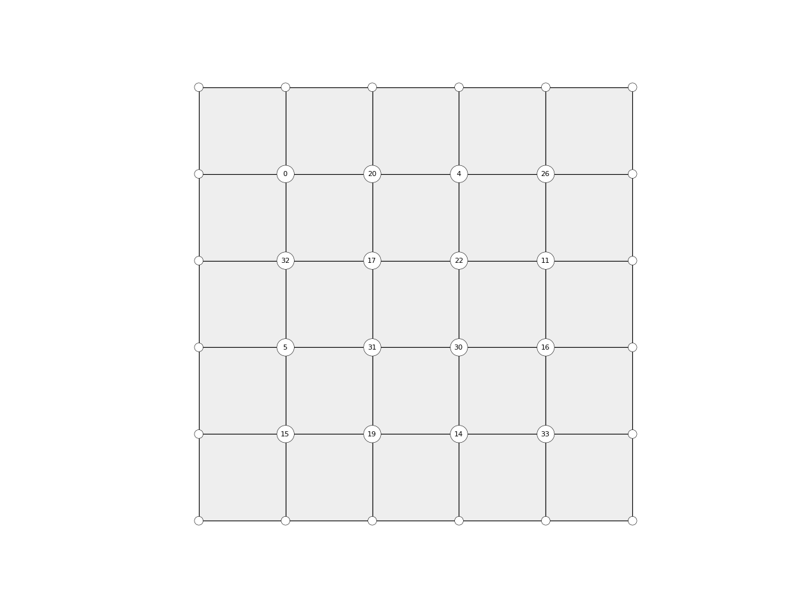

# COMPAS Mesh datastructure

## Import

```python

import compas

from compas.datastructures import Mesh

```

## Construction

**manual**

```python

import compas
from compas.datastructures import Mesh

mesh = Mesh()

a = mesh.add_vertex(x=0, y=0)
b = mesh.add_vertex(x=1, y=0)
c = mesh.add_vertex(x=1, y=1)
d = mesh.add_vertex(x=0, y=1)

mesh.add_face([a, b, c, d])

print(mesh)

```

**using constructors**

* `mesh = Mesh.from_vertices_and_faces()`
* `mesh = Mesh.from_lines()`
* `mesh = Mesh.from_obj()`
* `mesh = Mesh.from_ply()`
* `mesh = Mesh.from_stl()`
* ...

```python
    
import compas
from compas.datastructures import Mesh

mesh = Mesh.from_obj(compas.get('faces.obj'))

print(mesh)

```

## Visualisation

```python

import compas
from compas.datastructures import Mesh
from compas.plotters import MeshPlotter

mesh = Mesh.from_obj(compas.get('faces.obj'))

plotter = MeshPlotter(mesh)

plotter.draw_vertices(text='key', radius=0.15)
plotter.draw_edges()
plotter.draw_faces()

plotter.show()

```


## Working with the data

**looping**

```python

for key in mesh.vertices():
    print(key)

```

```python

for key, attr in mesh.vertices(True):
    # do something really great with the attributes
    # or just print

```

```python

for key in mesh.vertices_where({'vertex_degree': 2}):
    # do stuff

for key in mesh.vertices_where({'x': (2, 8), 'y': (2, 8)}):
    # do stuff

```

**listing**

```python

x = mesh.get_vertices_attribute('x')
xy = mesh.get_vertices_attributes('xy')

corners = mesh.get_vertices_attributes('xyz', keys=mesh.vertices_where({'vertex_degree': 2}))

```

**example**

* iass2018/exercises/day1/mesh_workingwiththedata.py

```python

import compas
from compas.datastructures import Mesh
from compas.plotters import MeshPlotter


mesh = Mesh.from_obj(compas.get('faces.obj'))

plotter = MeshPlotter(mesh)

plotter.draw_vertices(
    text={key: key for key in mesh.vertices_where({'x': (2, 8), 'y': (2, 8)})},
    radius={key: 0.2 for key in mesh.vertices_where({'x': (2, 8), 'y': (2, 8)})}
)
plotter.draw_edges()
plotter.draw_faces()

plotter.show()

```




## Queries

**general**

* `mesh.is_valid()`
* `mesh.is_regular()`
* `mesh.is_manifold()`
* `mesh.is_trimesh()`
* `mesh.is_quadmesh()`

**vertices**

* `mesh.vertex_neighbours()`
* `mesh.vertex_neighbourhood()`
* `mesh.vertex_faces()`
* `mesh.vertex_degree()`
* `mesh.vertex_area()`
* `mesh.vertex_normal()`
* `mesh.vertex_laplacian()`
* `mesh.vertex_coordinates()`
* `mesh.vertices_on_boundary()`
* `mesh.vertices_on_boundaries()`
* `mesh.is_vertex_on_boundary()`
* `mesh.is_vertex_connected()`


## Algorithms

* iass2018/exercises/day1/mesh_algorithms_geometry_smoothing.py
* iass2018/exercises/day1/mesh_algorithms_topology_remeshing.py
* iass2018/exercises/day1/mesh_algorithms_numerical_fd.py
* iass2018/exercises/day1/mesh_algorithms_numerical_dr.py


## CAD

* iass2018/exercises/day1/mesh_cad.py
